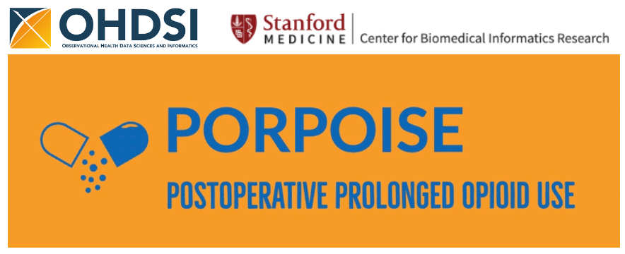

----------------------------

# PORPOISE: Development and External Validation of ML Models for Identifying Patients at Risk of Postoperative Prolonged Opioid Use

-----------------------------

The PORPOISE study develops and validates machine learning (ML) models to predict patients at risk of prolonged opioid use in a diverse, multisite cohort by evaluating not only their performance but also their generalizability, discrimination, and calibration abilities over different subgroups, including diabetes, depression, and obesity.
- Study Protocol: [PORPOISE-Study-Protocol-V1.0.pdf](./docs/PORPOISE-Study-Protocol-V1.0.pdf)
- Preliminary Results: [Shiny App](https://prolonged-opioid-use-prediction.shinyapps.io/shiny-app/)
- Participation Call: [OHDSI Forum](https://forums.ohdsi.org/t/call-for-participation-in-porpoise-a-network-study-on-omop-databases/)
- Project Introduction: [Slides](https://www.ohdsi.org/wp-content/uploads/2022/08/OHDSI-PORPOISE.pdf?_ga=2.167237366.951202879.1660248827-110566673.1652651887) and [Presentation](https://youtu.be/h7Hq76NLhUo)
- Oral Paper Presentations: 
  - Naderalvojoud, B., Hond, A., Shapiro, A., Coquet, J., Seto, T., Hernandez-Boussard, T. **Predicting Prolonged Opioid Use Following Surgery Using Machine Learning: Challenges and Outcomes** in *American Medical Informatics Association (AMIA) Annual Symposium*, Washington DC, 2022.
  
  - Naderalvojoud, B. and Hernandez-Boussard, T. **Machine Learning for Predicting Patients at Risk of Prolonged Opioid Use Following Surgery** in *Observational Health Data Sciences and Informatics (OHDSI) Annual Symposium*, Rockville MD, 2022. 

 
## Objectives

- Improve pain management following surgery.
- Identify patients at risk for prolonged opioid use prior to prescribing pain management regimens.
- Develop and validate ML models in a diverse, multisite cohort by evaluating their generalizability, discrimination, and calibration abilities.
- Evaluate the transportability of ML models based on population differences in the various CDM databases.

## Features
- Run the multiple prediction module to train five machine learning algorithms.
- Internal validation of the models trained on the local CDM dataset.
- External validation of previously trained models on the given CDM databases through three subgroup cohorts.

## Development
PORPOISE is being developed in R Studio using the OHDSI [PatientLevelPrediction](https://github.com/OHDSI/PatientLevelPrediction) R package.

## Requirements
- R version 4.1.3
- RStudio 2022.02.0
- JAVA
- RTools
- PatientLevelPrediction R package version 6.0.4
- FeatureExtraction R package version 3.2.0
- DatabaseConnector R package version 5.1.0
- OhdsiShinyModules R package version 1.0.0
- SqlRender R package version 1.10.0
- cdm version >=5.0.0

## Installation

The prediction module requires [PatientLevelPrediction](https://github.com/OHDSI/PatientLevelPrediction) (PLP) R package. The PLP package requires installing: 
- `R`, 
- `RStudio`, 
- `Java`
- `RTools` for Windows users
- `Xcode command line tools` for Mac and Linux users 

To install all the above requirements, please follow the instructions in the [R setup](https://ohdsi.github.io/Hades/rSetup.html) document provided by the OHDSI [HADES](https://ohdsi.github.io/Hades/index.html) team.
After setting up the R environment, you can install the PLP package as follows ([more information](https://github.com/OHDSI/PatientLevelPrediction/blob/main/inst/doc/InstallationGuide.pdf)).

```sh
install.packages("remotes")
remotes::install_github("ohdsi/FeatureExtraction")
remotes::install_github("ohdsi/OhdsiShinyModules")
remotes::install_github("ohdsi/PatientLevelPrediction")
```

The `remotes` will automatically install the latest release and all the latest dependencies. To determine the version of the package, you can run:
```sh
remotes::install_github("ohdsi/FeatureExtraction@v3.2.0")
remotes::install_github("ohdsi/PatientLevelPrediction@v6.0.4")
```

To install `SqlRender` and `DatabaseConnector`, run:

```sh
install.packages("SqlRender")
install.packages("DatabaseConnector")
```
If the CDM dataset is in BigQuery, the following package must be installed:
```sh
remotes::install_github("jdposada/BQJdbcConnectionStringR")
```

## Getting Started
The project's materials and methods are divided into the cohort and prediction studies.
### Cohort Study
The [OHDSI ATLAS](https://www.ohdsi.org/atlas-a-unified-interface-for-the-ohdsi-tools/) software was used to define and characterize the project cohorts. The cohort study of PORPOISE is carried out by sharing JSON rather than R code, so project partners can obtain the results without knowing R and visually explore the cohort inclusion criteria and characterization settings in ATLAS. The `cohort-study` folder contains the JSON file pertaining to the cohorts' definition and characterization settings that can be imported and executed on any ATLAS instance. 

To run the cohort definition in ATLAS:
- Go to the `Cohort Definitions` from the left menu bar
- Click on the `New Cohort` button
- Go to `Export` tab
- Go to `JSON` tab
- Add the JSON into the text box
- Click on the `Reload` button
- Save the cohort
- Go to the `Generation` tab and click on the `Generate` button

To run cohort characterization in ATLAS:
- Go to the `Characterizations` from the left menu bar
- Click on the `New Characterization` button
- Go to `Utilities` tab
- Go to `Import` tab
- Add the JSON into the text box
- Click on the `Import` button
- Save the setting
- Go to the `Executions` tab and click on the `Generate` button

All JSONs include the necessary concept sets and can be used independently.

### Prediction Study
The PORPOISE prediction study was developed using the OHDSI PLP R package and can be run with two settings:
- Model training with internal validation
- External validation of pre-trained models

Both settings make use of the same code in different configurations. All the configuration is done through `config.yml` in the `config` folder. The config file is classified into four groups: `run`, `bq`, `db`, and `cdm`.

All the parameters in the `run` class are described in the table below:

| `run` Parameter | Description |
| ------ | ------ |
| type (including 'multiple' and 'cohort')| if it is set to 'multiple', the multiple prediction module is run. In type 'cohort', the prediction is not run and the cohort and CDM subset generators are run if their parameters are set to yes.|
| external_validation (Yes/No) | If `Yes`, previously trained models will be validated on the specified CDM dataset. If the value is `No`, local training with internal validation is performed.|
|validation_subgroup (Yes/No)|If `Yes`, previously trained models will be validated on the target cohort as well as three subgroups: diabetes, depression, and obesity.|
| cohort_generator (Yes/No)| If `Yes`, target and outcome cohorts will be generated prior to training. This parameter can only be set to `Yes` once. After the cohorts are generated in the first run, you no longer need to set this parameter to Yes for subsequent runs, and it can be set to `No`.|
|cohort_subgroup_generator (Yes/No)|If `Yes`, the three subgroup cohorts are generated from the target cohort and saved in the cohort table. These sub-cohorts will be used only in external validation.|
| cdm_subset_generator (Yes/No)|Because some CDM tables are big and are maintained in the cloud with a query charge, you can create a subset of clinical tables in a working schema (determined as `target_database_schema` in the config file). If it is set to `Yes`, a subset of CDM tables with records related to the subjects in the target cohort is created. Furthermore, feature extraction necessitates the creation of temporal tables in order to extract the required covariates, which may be prohibited by the CDM schema. Hence, we generate a subset of CDM in a `target_database_schema`.|
|models (LR, RF, AB, GB, NB)| This parameter indicates all models included in the multiple prediction module. It includes 'LR' (Lasso Logistic Regression), 'RF' (Random Forest), 'AB' (AdaBoost), 'GB' (Gradient Boosting Machine), and 'NB' (Naive Bayes).|

Some CDM data warehouses, e.g., BigQuery, require credentials for access. If you use BQ, you must configure all of the following parameters.

| `bq` Parameter | Description |
| ------ | ------ |
| credentials | Credentials JSON path|
| driverPath | [JDBC Driver](https://storage.googleapis.com/simba-bq-release/jdbc/SimbaJDBCDriverforGoogleBigQuery42_1.2.16.1020.zip)  path for BigQuery|
| projectId | Project name |
| defaultDataset | Working dataset name |

For other databases, you should configure the following parameters. If the target dataset is not in BQ, it must be removed from the config file. If the `bg` is not found, the system checks the `db` automatically. 
| `db` Parameter | Description |
| ------ | ------ |
| dbms | The dbms name, e.g., `postgresql`|
| server | Database Server URL|
| port | Database port|
|user| Database user name|
| password | Database password |
| driverPath | Path to the db driver|

All the parameters related to the CDM dataset is described below:
| `cdm` Parameter | Description |
| ------ | ------ |
| target_database_schema | Working schema containing the cohort table and CDM subset|
| cohort_table | Cohort table name|
| target_cohort_id | target cohort id|
| outcome_cohort_id | outcome cohort id|
| diabetes_cohort_id | diabetes cohort id|
| depression_cohort_id | depression cohort id|
| obesity_cohort_id | obesity cohort id|
| vocabulary_database_schema | CDM vocabulary database schema|
| cdm_database_schema |CDM database schema containing all clinical tables|
| cdm_database_name |CDM database name|


#### Model training with internal validation 
Before training models, you need to generate the target and outcome cohorts in the target database schema (your working schema), as well as a subset of the CDM dataset. To that end, you need to set `cohort_generator` and `cdm_subset_generator` to 'Yes' and run the `main.R` in the `src` folder.

You can also set the `cohort_subgroup_generator` to 'Yes' to generate external validation subgroups for later use. The CDM subset generator only creates relevant clinical tables. You may also need to make a copy of `concept` and `concept_ancestor` in your target schema manually. To train the local models, you only need to set the `external_validation` parameter to 'No', and run the main.R as follows:

```sh
Rscript ./src/main.R
```

You can run the cohort generator and prediction modules simultaneously or separately.
To only run the cohort generator, the config file should be configured as follows:
- `type`: "cohort"
- `external_validation`: "No"
- `validation_subgroup`: "No"
- `cohort_generator`: "Yes"
- `cohort_subgroup_generator`: "Yes"
- `cdm_subset_generator`: "Yes"

To only run the multiple prediction module, the config file should be set up as follows: 
- `type`: "multiple"
- `external_validation`: "No"
- `validation_subgroup`: "No"
- `cohort_generator`: "No"
- `cohort_subgroup_generator`: "No"
- `cdm_subset_generator`: "No"

To only run the external validation module, the config file should be set up as follows: 
- `type`: "multiple"
- `external_validation`: "Yes"
- `validation_subgroup`: "Yes"
- `cohort_generator`: "No"
- `cohort_subgroup_generator`: "No"
- `cdm_subset_generator`: "No"

The default cohort table and ids are as follows. Any new cohort table with any ids can be created.
- `cohort_table`: "cohort"
- `target_cohort_id`: 1
- `outcome_cohort_id`: 2
- `diabetes_cohort_id`: 3
- `depression_cohort_id`: 4
- `obesity_cohort_id`: 5

#### Multiple prediction output
By executing the multiple prediction module, the `PlpMultiOutput` folder will be created. This folder will contain five `Analysis` folders corresponding to prediction models, two target cohort folders, and a settings.csv file, as well as a sqlite folder containing `databaseFile.sqlite` to store all prediction results.

- Each analysis folder must include:
  - `plpLog.txt`
  - `diagnosePlp.rds`
  - `plpResult` folder including:
    - `runPlp.rds`
    - `model` folder including: 
      - `attributes.json`
      - `covariateImportance.csv` (only for LR)
      - `model.json` or model folder including `model.pkl` 
      - `modelDesign.json`
      - `preprocessing.json`
      - `trainDetails.json`
- targetId folder must include:
  - `cohorts.rds`
  - `covariates`
  - `metaData.rds`
  - `outcomes.rds`
  - `timeRef.rds`

To share the models for external validation, partners only need to keep the content of the model folder in `./PlpMultiOutput/Analysis_*/plpResult/model` and `databaseFile.sqlite` file in `./PlpMultiOutput/sqlite` folder. You can delete all other folders and share them with us.

#### External validation of pre-trained models
To validate pre-trained models, you need to 
- Set up the `config.yml` file, including the `db` or `bg` and `cdm` parameters for the external validation database, and set the `external_validation` and , `cohort_subgroup_generator` parameters to 'Yes' (if you have already generated the subgroups, there is no need to set `cohort_subgroup_generator` to 'Yes'), 
- Place already trained results in the `PlpMultiOutput` folder,
- Run the `main.R`.

The results of external validation will be generated in the `./PlpMultiOutput/Validation` path.
The `Validation` folder contains four sub-folders for each cohort  id, including target and evaluation subgroups. Each cohort id folder must contain five `Analysis` folders that correspond to those created in the `PlpMultiOutput` folder.

#### Reporting results
After running the prediction module, both internal and external validation results are automatically inserted into a `databaseFile.sqlite` file in the `./PlpMultiOutput/sqlite` folder. If the sqlite file is created correctly, you will be able to see both the internal and external validation results using the Shiny app. To run the shiny app after running the prediction module, run the following code by giving the output folder path:
```sh
viewMultiplePlp("./PlpMultiOutput")
```
In addition to the sqlite file, the prediction module also exports the results through a set of CSV files in the `./PlpMultiOutput/csv` folder. To share the results, you only need to send us the `databaseFile.sqlite` file. The results do not include any PHI or high-risk data. However, the partners may review the content of the results in the csv files based on their institution's policy.

*It is worth noting that the prediction module generates an output folder called "PlpMultiOutput". As a result, when training new models or validating pre-trained models, the output folders must be managed manually to avoid overwriting.*

## Support
If you require assistance with the project, please contact Dr. Behzad Naderalvojoud at behzadn[at]stanford[dot]edu or [OHDSI forum](https://forums.ohdsi.org/t/call-for-participation-in-porpoise-a-network-study-on-omop-databases/).

### Potential errors
The following errors may occur while the prediction module is running. If you encounter an error, please send us the corresponding log file. Separate log files are created in the corresponding folders for each model. You can also save and send us all the console process logs (for the entire process).

#### Memory error
When running the multiple prediction module, some errors may occur, such as insufficient memory for `plpData`. The multiple prediction module should be run with at least 16 GB of RAM. This error may cause issues with the results, and you may need to restart the module.

#### Table already exists error
Any interruption during feature extraction causes temp tables to remain in the target database schema (your working schema). As a result, you must explore your database schema to see if any temp tables exist and then delete them all. Otherwise, the feature extraction module would throw an exception.

#### Permission denied error
When the prediction module is executed, some temp tables in the target database schema are created. If you do not have write permission, you may encounter an error during the run. This is another reason why the CDM database schema is separated from the target schema and a subset of CDM is generated in the target database schema.

#### Attribute error
Object has no attribute 'feature_importances_'. This error may occur in a few models that lack a function to calculate the importance of features. This will have no effect on the outcome.

## License
PORPOISE is licensed under Apache License 2.0.

